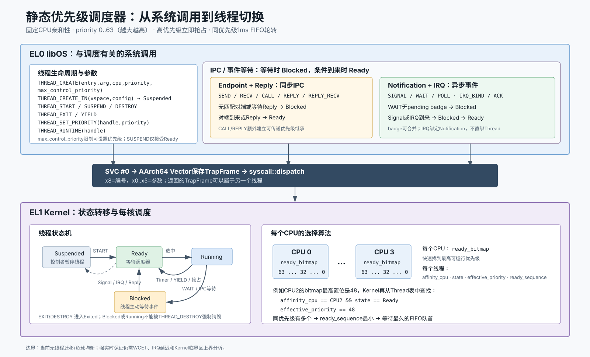

# 从系统调用理解静态优先级调度器



## 1. 当前调度模型

当前 Kernel 是四核、固定 CPU 亲和性的静态优先级抢占调度器：

```text
每个 CPU 独立维护 Ready 集合
→ 从 63..0 选择最高 effective_priority
→ 同优先级选择 ready_sequence 最小的线程
→ 运行最多 1 ms
→ 时间片到期后排到同级队尾
```

- 优先级范围是 `0..63`，数值越大越先运行。
- 当前 Thread 表最多保存 16 个线程；启动主线程固定在 CPU0，初始优先级为 32，`max_control_priority` 为 63。
- `base_priority` 是用户配置的基础优先级。
- `effective_priority` 是调度器实际使用的优先级，可因 Endpoint Call 优先级继承而临时升高。
- 线程创建时固定到一个 CPU，当前不迁移、不负载均衡。
- 工作保持是“每核”的：本核有 Ready 线程就不空转；但其他核不会抢走该线程。
- 更高优先级线程变为 Ready 时可立即抢占；同优先级线程不立即抢占，等待 1 ms 时间片到期或当前线程主动 `YIELD`。

这里的“静态优先级”表示调度规则不会根据 CPU 占用率自动调整优先级，不表示优先级永远不能修改。用户可以在 `max_control_priority` 授权范围内调用 `THREAD_SET_PRIORITY`。

## 2. 从 SVC 进入调度器

EL0 调用约定是：

```text
x8      = syscall 编号
x0..x5  = 参数，x0同时承载普通返回值
svc #0
```

Kernel 的完整路径是：

```text
libOS kernel_api 封装
→ svc #0
→ AArch64 vector 保存 x0..x30、SP_EL0、ELR_EL1、SPSR_EL1
→ 形成 TrapFrame
→ syscall::dispatch 读取 x8 和 x0..x5
→ Thread / IPC / Notification 修改线程状态
→ scheduler 选择应该运行的 Thread TrapFrame
→ 异常返回汇编恢复该 TrapFrame
→ eret 返回被选中线程的 EL0 PC/SP
```

因此，一次系统调用不一定返回原调用者。例如 `NOTIFICATION_WAIT` 阻塞当前线程后，Kernel 会返回另一个 Ready 线程的 `TrapFrame`。

## 3. 直接控制线程的系统调用

### 3.1 创建与启动

| 系统调用 | 参数 | 当前语义 | 对调度器的影响 |
| --- | --- | --- | --- |
| `THREAD_CREATE` | `entry, arg, cpu, priority, max_control_priority` | 在当前 VSpace 创建线程，Kernel 自动分配栈和 IPC Buffer | 创建成功后直接进入 `Ready`，可立即抢占目标 CPU 上的低优先级线程 |
| `THREAD_CREATE_IN` | `vspace_handle, config_va` | 把用户态 `ThreadCreateConfig` 复制进 Kernel，在目标 VSpace 创建线程 | 初始状态是 `Suspended`，不参与调度 |
| `THREAD_START` | `thread_handle` | 发布已完成映射和上下文配置的线程 | `Suspended → Ready`，可触发本核或远程核抢占 |

`max_control_priority` 是该线程以后调整其他线程优先级时的上限。Kernel 同时检查 `priority <= max_control_priority <= 63`。

### 3.2 让出、优先级与运行时间

| 系统调用 | 参数 | 当前语义 | 对调度器的影响 |
| --- | --- | --- | --- |
| `THREAD_YIELD` | 无 | 主动结束当前时间片 | 保存上下文，`Running → Ready`，分配新 `ready_sequence`，再选最高优先级 |
| `THREAD_SET_PRIORITY` | `thread_handle, priority` | 修改基础优先级，不得超过调用者的 `max_control_priority` | 更新 Ready 级别；目标正在运行时发送重调度 SGI |
| `THREAD_RUNTIME` | `thread_handle` | 返回 Generic Timer ticks 累积的 CPU 运行时间 | 只查询，不改变状态和排队次序 |

`YIELD` 不是“让给指定线程”。它只是把当前线程重新放入 Ready 集合，最终仍由“最高有效优先级 + 同级 FIFO”决定下一个线程。

### 3.3 暂停、退出与销毁

| 系统调用 | 参数 | 当前语义 | 限制 |
| --- | --- | --- | --- |
| `THREAD_SUSPEND` | `thread_handle` | `Ready → Suspended` | 不能强制暂停 `Running` 或 `Blocked` 线程，返回 `BUSY` |
| `THREAD_EXIT` | `exit_code` | 当前线程自行退出 | 清理 IPC 等待关系、栈和 IPC Buffer，然后调度其他线程 |
| `THREAD_DESTROY` | `thread_handle` | 控制者销毁一个非运行线程 | `Running` 或 `Blocked` 时拒绝；成功后 generation 更新，旧 Handle 失效 |

## 4. 会改变线程状态的 IPC 系统调用

### 4.1 Endpoint + Reply：同步 IPC

Endpoint 使用每线程独立 IPC Buffer 携带消息，syscall 只传递 Handle。

| 系统调用 | 调度语义 |
| --- | --- |
| `ENDPOINT_CREATE` | 创建对象，不调度 |
| `ENDPOINT_SEND` | 没有 Receiver 时 Sender `Running → Blocked`；已有 Receiver 时交付消息并唤醒对方 |
| `ENDPOINT_RECV` | 没有 Sender 时 Receiver `Running → Blocked`；已有 Sender 时立即取消息 |
| `ENDPOINT_CALL` | 向 Server 发送请求，Caller 必须阻塞到 Reply；建立 `caller → server` 优先级继承关系 |
| `ENDPOINT_REPLY` | 使用一次性 ReplyHandle 唤醒 Caller，删除该继承关系并重算优先级 |
| `ENDPOINT_REPLY_RECV` | 原子完成“回复上一个 Caller + 等待下一个请求”；无新请求时 Server 阻塞 |
| `ENDPOINT_DESTROY` | 只能销毁没有 Sender、Receiver 和未完成 Reply 的 Endpoint |

Call 优先级继承使用最多 16 轮有界重算，可传递：

```text
高优先级 Client CALL 低优先级 Server
→ Server.effective_priority 临时提升
→ Server 尽快完成请求
→ REPLY 唤醒 Client
→ 删除 Reply 关系，Server 恢复按 base_priority 计算
```

`SEND` 和 Notification 不建立长期优先级继承关系。

### 4.2 Notification：异步事件

| 系统调用 | 调度语义 |
| --- | --- |
| `NOTIFICATION_CREATE` | 创建带 pending badge 位图的异步事件对象 |
| `NOTIFICATION_SIGNAL(handle, badge)` | 不等待接收方；把 badge 按位 OR 到 pending，有 Waiter 时唤醒一个 |
| `NOTIFICATION_WAIT(handle)` | pending 非零时立即取出并清零；否则当前线程 `Running → Blocked` |
| `NOTIFICATION_POLL(handle)` | 非阻塞查询，没有事件时返回 `WOULD_BLOCK` |
| `NOTIFICATION_DESTROY(handle)` | 已绑定 IRQ 或仍有 Waiter 时拒绝销毁 |

`SIGNAL` 唤醒本核更高优先级线程后，Kernel 在返回 Signal 发送者前调用 `preempt_if_needed`。如果被唤醒线程固定在其他 CPU，Ready 发布路径会在必要时发送 SGI0。

## 5. IRQ 如何唤醒高优先级驱动线程

IRQ 不直接绑定 Thread，而是绑定 Notification：

| 系统调用 | 参数 | 作用 |
| --- | --- | --- |
| `IRQ_BIND` | `intid, notification, badge, target_cpu` | 验证 IRQ grant、Notification owner、badge 和 CPU，配置 GIC SPI 目标核 |
| `IRQ_ACK` | `intid` | 驱动处理完设备状态后，重新允许该 SPI |
| `IRQ_UNBIND` | `intid` | 禁用 SPI 并删除 IRQ 到 Notification 的绑定 |

以 xHCI 为例：

```text
USB线程: NOTIFICATION_WAIT
→ 无pending，USB线程 Blocked
→ xHCI产生SPI
→ GIC进入EL1 IRQ handler
→ Kernel暂时disable SPI、EOI、向Notification OR badge
→ USB线程 Blocked → Ready
→ 若它比目标CPU当前线程优先级高，立即抢占
→ EL0处理xHCI Event Ring
→ IRQ_ACK重新开放SPI
```

Kernel 只负责 GIC、Notification 投递和线程唤醒；xHCI Event Ring、USB 协议和设备状态仍由 EL0 libOS 处理。

## 6. Ready 选择和抢占细节

### 6.1 每核 64 位优先级图

每个 CPU 有一个 `u64 ready_bitmap`：

```text
bit 63 = 是否存在priority 63的Ready线程
...
bit 0  = 是否存在priority 0的Ready线程
```

Kernel 使用最高置位找到最高优先级，再在最多 16 个 Thread 表项中选择该级 `ready_sequence` 最小的线程。

### 6.2 1 ms 同级轮转

线程每次被激活时，Kernel 重新装载本核 ARM Generic Physical Timer：

```text
CNTP_TVAL_EL0 = CNTFRQ_EL0 / 1000
CNTP_CTL_EL0  = 1
ISB
```

Timer PPI 到期后：

```text
累加当前线程runtime_ticks
→ Running → Ready
→ 分配新ready_sequence，相当于进入同级队尾
→ 重新选择最高优先级线程
```

只有一个 Ready 线程时，它在每次 1 ms 到期后仍会再次被选中，所以可以接近占用本核 100% CPU。

### 6.3 本核和跨核抢占

- 本核在 syscall 或 IRQ 中唤醒更高优先级线程时，异常返回前直接换用新 `TrapFrame`。
- 远程核正在运行低优先级线程时，Kernel 向目标核发送 GIC SGI0，迫使其进入 EL1 重新选择。
- 目标核处于 `WFE` idle 时，Ready 发布路径执行 `SEV`，唤醒它重扫 Ready bitmap。

## 7. 线程状态机

```text
THREAD_CREATE                         THREAD_CREATE_IN
      |                                      |
      v                                      v
    Ready <------ THREAD_START ---------- Suspended
      |  ^                                  ^
      |  +------- THREAD_SUSPEND -----------+
      v
   Running -- Timer/YIELD/高优先级抢占 --> Ready
      |
      +-- WAIT/RECV/SEND/CALL等待 --> Blocked
      |                                  |
      |                                  +-- Signal/IRQ/Peer/Reply --> Ready
      |
      +-- THREAD_EXIT --> Exited

非Running、非Blocked -- THREAD_DESTROY --> Exited
```

## 8. 当前实现的边界

1. 优先级抢占、固定 CPU 亲和性和 Endpoint Call 优先级继承已实现。
2. 调度器每核工作保持，但不会自动把线程迁移到空闲 CPU。
3. 只有 Endpoint `CALL/REPLY` 建立优先级继承；Notification、IRQ 和单向 Send 只唤醒线程。
4. 静态优先级可降低关键线程的调度延迟，但当前还没有完成 WCET、Kernel 临界区上界、IRQ 延迟上界和可调度性分析，因此不等于已证明的强实时系统。

## 9. 源码导航

- syscall 参数取出和分发：`kernel/src/syscall/dispatch.rs::handle_svc_frame`
- Thread 表、状态和上下文：`kernel/src/object/thread.rs`
- 最高优先级选择、时间片和抢占：`kernel/src/scheduler/priority.rs`
- Generic Timer 编程：`kernel/src/scheduler/timer.rs`
- Endpoint、Reply、Notification 和优先级继承：`kernel/src/object/ipc.rs`
- libOS Thread 封装：`libos/src/kernel_api/thread.rs`
- libOS Endpoint 封装：`libos/src/kernel_api/endpoint.rs`
- libOS Notification 封装：`libos/src/kernel_api/notification.rs`
