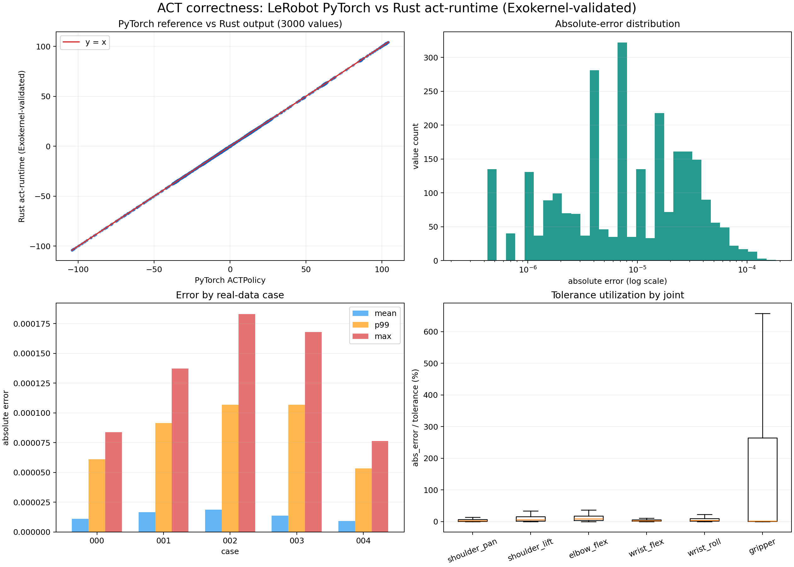
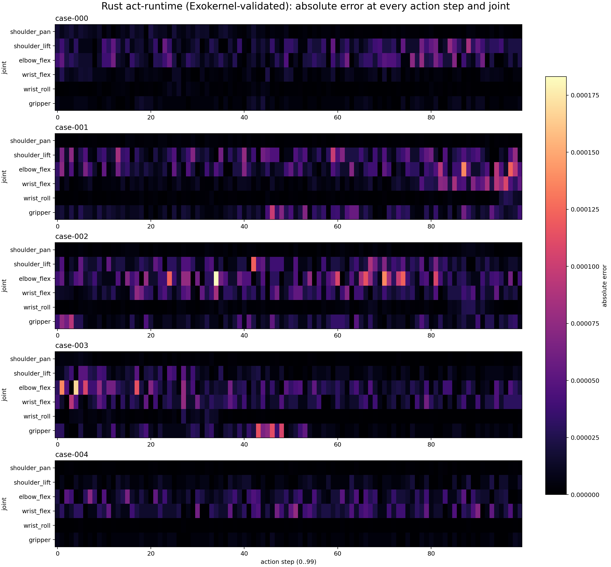

# 实验 02：ACT 真实数据推理正确性验证





## 1. 实验目标

从模型对应的真实LeRobot数据集中固定提取若干组输入，分别交给官方PyTorch策略、
Linux Rust进程、Exokernel EL0和seL4 Root Task中的`act-runtime`执行完整ACT前向，
验证三个Rust被测环境的`100 x 6`输出与PyTorch参考一致。

本实验只回答“推理结果是否正确”，不比较速度。实验03必须在本实验通过后才能
使用该实现采集性能数据。

对比关系必须按下面理解：

```text
唯一真值：本仓库 lerobot/src/lerobot/policies/act/modeling_act.py
             中的 ACTPolicy.predict_action_chunk() + PyTorch

被测对象：自研 Rust act-runtime
运行环境：Linux Rust进程 / Exokernel EL0 / seL4 Root Task
```

Linux、Exokernel和seL4不是三个参考实现；它们是同一个Rust被测后端的三个目标系统。

```text
同一两张原始RGB图像 + 同一六维舵机状态
                  |
        +---------+---------+---------+
        |         |         |         |
     PyTorch  Linux Rust  Exokernel  seL4
        +------ 比较完整100 x 6 -------+
```

## 2. 固定对象

模型与数据集固定为：

```text
模型：Vel044/so101_act_bottle
数据：Vel044/so101_bottle
```

本机持久化位置固定为：

```text
Lerobot/data/act/model/        模型、配置和normalizer
Lerobot/data/act/dataset/      Parquet、元数据和两路完整视频
Lerobot/data/act/correctness/  五组冻结输入、PyTorch真值和实验bundle
```

这些目录位于各个子Git仓库之外，不会随`/tmp`清理，也不会默认提交大型资产。

运行实验时必须记录：

```text
模型仓库commit
数据集仓库commit
LeRobot commit
act-runtime commit
model.safetensors SHA-256
normalizer.safetensors SHA-256
每个输入文件SHA-256
```

模型输入和输出固定为：

```text
observation.images.handeye  RGB，3 x 360 x 640
observation.images.fixed    RGB，3 x 360 x 640
observation.state           6个float32
action                      100 x 6个float32
```

## 3. 样本选择

从`episode 0`选择五个时刻：该episode有效长度的10%、30%、50%、70%和90%。提取脚本
必须把最终解析出的`episode_index`、`frame_index`、全局索引和视频时间戳写入
清单，之后不再按比例动态选择。

五个样本覆盖动作从开始到结束的不同视觉与关节状态。以后可以追加
episode，但不能覆盖既有样本和参考输出。

## 4. 输入冻结

视频只在宿主参考环境中解码一次。每个样本生成：

```text
case-000/handeye.rgb       640 x 360 x 3，RGB字节
case-000/fixed.rgb         640 x 360 x 3，RGB字节
case-000/state.f32le       6个IEEE 754 little-endian float32
case-000/manifest.json     索引、shape、dtype、时间戳和SHA-256
```

PyTorch和Exokernel都读取这些冻结后的原始字节，禁止各自重新解码MP4。这样可以
排除FFmpeg版本、色彩格式、时间戳取整和视频seek造成的输入差异。

清单还必须保存每张图像的布局和取值语义：

```text
磁盘布局：HWC RGB u8
图像范围：0..255
状态布局：[6]
字节序：little-endian
```

## 5. PyTorch参考输出

参考程序使用模型仓库对应的LeRobot ACT策略和processor：

```text
CPU执行
float32
eval模式
关闭autocast和混合精度
固定随机种子
使用仓库中的normalizer
```

每个样本保存完整输出，不能只保存少数动作点：

```text
case-000/pytorch-action.f32le   100 x 6个float32
case-000/pytorch-action.json    shape、dtype和摘要
```

摘要至少包含每个关节的`min/max/mean`以及整个输出的SHA-256。二进制float文件才是
逐元素比较基准，JSON中的十进制文本不作为基准，避免格式化精度损失。

## 6. Exokernel执行路径

测试向量与模型一起写入只读ext4镜像：

```text
QEMU virtio-blk
-> EL0 ext4文件系统
-> 读取model、normalizer和冻结输入
-> act-runtime完整前向
-> 与pytorch-action.f32le逐元素比较
```

EL0应用必须输出：

```text
case编号
模型与输入SHA-256是否匹配
输出shape
有限值检查
mean_abs_error
RMSE
max_abs_error及其(step, joint)
六个关节各自的max_abs_error
PASS或FAIL
```

准备脚本可使用宿主辅助程序生成逐元素CSV，以便在进入QEMU前定位模型解析、预处理
或算子错误。该辅助程序不是正式对比对象，其耗时和结果不进入系统实验结论。

## 7. 数值判定

基础检查：

```text
输出shape == [100, 6]
600个元素全部为有限float32
动作顺序和关节顺序与模型配置一致
```

逐元素使用：

```text
abs(actual - reference) <= atol + rtol * abs(reference)
atol = 1e-8
rtol = 1e-5
```

同时记录而不隐藏：

```text
mean_abs_error
RMSE
max_abs_error
失败元素数量
```

由于不同实现可能使用不同的FMA、归约顺序和softmax近似，不要求二进制完全一致；
但不能为了让实验通过而在看到结果后临时放宽阈值。需要调整阈值时，必须先定位
误差来源，并把原因和新阈值作为实验版本变更记录下来。

## 8. 防止伪正确

必须额外执行以下检查：

1. 将handeye和fixed交换，输出必须发生明显变化。
2. 将六维state中的一个关节修改固定增量，输出必须发生变化。
3. 五个真实样本的输出不能完全相同。
4. Exokernel必须比较全部600个元素，不能只比较当前smoke中的代表点。
5. 任一模型、normalizer或输入SHA-256不匹配时立即停止，不能继续比较。

这些检查用于避免输入没有真正进入网络、相机顺序接反、状态被忽略或只验证少数
硬编码输出等问题。

## 9. 原始结果格式

每次运行保存一行：

```text
system,system_commit,runtime_commit,model_commit,dataset_commit,
case_id,episode_index,frame_index,output_count,mean_abs_error,rmse,
max_abs_error,max_error_step,max_error_joint,failed_elements,valid
```

逐元素结果另存为二进制文件或CSV：

```text
case_id,step,joint,reference,actual,abs_error,tolerance,pass
```

本次QEMU Linux Rust实测已保存完整CSV：

- [五组合并3000行](./results/linux-rust/full-output/all-cases-pytorch-vs-rust.csv)
- [case-000：600行](./results/linux-rust/full-output/case-000-pytorch-vs-rust.csv)
- [case-001：600行](./results/linux-rust/full-output/case-001-pytorch-vs-rust.csv)
- [case-002：600行](./results/linux-rust/full-output/case-002-pytorch-vs-rust.csv)
- [case-003：600行](./results/linux-rust/full-output/case-003-pytorch-vs-rust.csv)
- [case-004：600行](./results/linux-rust/full-output/case-004-pytorch-vs-rust.csv)

本次Exokernel四核优化后端的五组QEMU/HVF实测摘要：

- [Exokernel五组正确性与耗时](./results/2026-08-13-exokernel-hvf-summary.csv)
- [Exokernel完整串口日志](./results/2026-08-13-exokernel-hvf-correctness.log)

五组共比较`3000`个输出；在采用PyTorch默认`atol/rtol`后，必须以重新生成的
逐元素CSV和统计结果中的`failed`为准。单次前向耗时为`4350..4656 ms`，本结果
用于确认当前四核行并行后端的数值正确性，正式性能横向比较仍放在实验03中完成。

每行都包含：

```text
case_id, step, joint,
pytorch_reference, rust_actual,
signed_error, abs_error, tolerance, pass
```

## 10. 实施步骤

1. 下载并锁定模型与数据集commit。
2. 下载两路完整MP4，提取episode 0的五个固定样本。
3. 生成原始RGB、state、manifest和所有SHA-256。
4. 在宿主环境运行官方PyTorch策略，保存完整参考动作序列。
5. 生成Rust后端逐元素输出和误差CSV，作为可审计的准备产物。
6. 在Linux Rust进程中运行同一`act-runtime`并比较全部600个输出。
7. 把同一测试向量和参考输出写入QEMU只读ext4镜像。
8. 运行Exokernel correctness应用并比较全部600个输出。
9. 把同一bundle放入seL4 Root Task CPIO，运行同一`act-runtime`并比较。
10. 执行相机交换和state扰动检查。
11. 保存原始结果；三个Rust环境全部通过后才开始实验03。

## 11. 验收条件

- 五个真实样本使用同一组冻结输入字节和同一模型文件。
- PyTorch参考运行在CPU float32 eval模式。
- Linux Rust、Exokernel和seL4都比较完整`100 x 6`输出。
- 每个样本全部600个元素满足固定`atol/rtol`。
- 防止伪正确的相机交换与state扰动检查通过。
- 实验产物包含commit、SHA-256、manifest、参考输出和逐元素误差。
- 任何样本失败时，实验03的该实现不得进入性能统计。

## 12. 当前 bottle 基线

2026-08-13已将所有默认实验切换到`Vel044/so101_act_bottle`：

```text
model commit  = 1c9b9309c387041f051e4ded0199e79f538f4984
dataset commit= 4b5f3bc6638db278caaf6b3b1696bdb49493ad3a
model SHA-256 = bf84b9539455980c6f0c5f1533e7a11794ae63dfbe006d1f9e233291c45df671
stats SHA-256 = 886e06102c117054b2cfc7a2c8a8c4a87a6eca40462431437cc8d188f44e00ad
```

宿主预检使用PyTorch默认`atol/rtol`重新判定后，五组真实输入中有210个动作
元素不满足逐元素阈值：

```text
mean absolute error = 0.000013834
max absolute error  = 0.000183105
failed elements     = 210 / 3000
failed by case      = case-000:16, case-001:50, case-002:102, case-003:42, case-004:0
```

这说明当前Rust后端与PyTorch的数值差异虽然仍在`1e-4`量级，但不能再宣称
满足`torch.allclose`默认阈值；正式实验结论必须标记为FAIL，不能进入实验03性能统计。

旧classification结果不再作为默认实验结论。下面内容仅保留为历史运行记录，
必须使用bottle重新运行Linux QEMU、seL4 QEMU和Exokernel QEMU后才能更新横向结论。

## 13. 历史 classification 实测结果（已停用）

资产版本：

```text
model commit  = e08adb80bd1809ddb0851519147181db2c16e96f
dataset commit= a87d648aaa0249a8f5aef7c62c2935f18b58623b
model SHA-256 = 9f7b1f15c98dc283fdc3f946e13c037466b3cf642c81696fa617e87d63c5f062
stats SHA-256 = ce4f2b3075bd34a471a9e6845af269d517a790c4636dc5e47fe9e2aa9a37da46
bundle SHA-256= be43e62056047e8aa1841595d6ef2da84348bc0b37f97f1c3d5c06d740c6580f
Linux Kernel  = Alpine 6.12.94-0-virt
Kernel SHA-256= f270bfa4324e37f0a28662909b0450c802c8279143f353cbc7fe250cdfb733a8
```

两路完整视频已下载，episode 0冻结的frame为`88, 263, 439, 615, 790`。
PyTorch生成参考后，Linux Rust、Exokernel和seL4都已比较完整600个元素。Linux
路径在`QEMU virt + Cortex-A76 + 4 CPU + 4 GiB + Alpine Linux 6.12.94`中实测，
其完整float32输出由guest写回ext4后导出，并非宿主辅助运行结果：

| case | Linux Rust max abs | seL4 QEMU max abs | Exokernel QEMU max abs | 三方失败元素 |
| --- | ---: | ---: | ---: | ---: |
| 000 | 0.000186920 | 0.000186920 | 0.000186920 | 0 |
| 001 | 0.000118256 | 0.000118255 | 0.000118255 | 0 |
| 002 | 0.000076294 | 0.000076293 | 0.000076293 | 0 |
| 003 | 0.000137329 | 0.000137329 | 0.000137329 | 0 |
| 004 | 0.000127792 | 0.000127792 | 0.000127792 | 0 |

```text
Linux Rust:       PASS, 5 cases / 3000 values
seL4 QEMU:        PASS, 5 cases / 3000 values
Exokernel QEMU:   PASS, 5 cases / 3000 values, EL0 exit code 0
```

QEMU TCG耗时只作功能日志：Linux每组约97到107秒，seL4每组约198到225秒，
Exokernel每组约310到392秒。三者QEMU启动形态和计时边界尚未统一，该数字不可
作为OS性能结论；正式速度比较留给实验03的统一环境。

### 运行命令

```bash
# 重新从完整视频提取五组输入、跑PyTorch并生成bundle
bash exokernel/experiment/02-ACT真实数据推理正确性验证/run_prepare.sh

# Linux Rust一键路径：构建 → QEMU推理 → 导出3000行CSV → 生成分析图
bash exokernel/experiment/02-ACT真实数据推理正确性验证/linux-qemu/all.sh

# Exokernel QEMU的ext4 -> EL0路径
cd exokernel
LIBOS_APP=act-inference QEMU_USB_MODE=none bash qemu/run.sh

# seL4 QEMU的CPIO -> Root Task路径
cd sel4test-qemu-arm-virt/projects/act-inference-demo
bash run.sh
```
